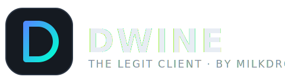

<p align="center">
  
</p>

<h3 align="center">A lean, fully legitimate launcher for modded Minecraft.</h3>

<p align="center">
  Python-powered · Every version · Vanilla / Fabric / Quilt / Forge · No Azure setup · 100% non-bannable by design
</p>

<p align="center">
  
  
  
  
</p>

---

Dwine does exactly four things, and does them well:

1. **Signs you in with a link code.** Click *Sign in with Microsoft*, enter a
   short code at [microsoft.com/link](https://www.microsoft.com/link) — from
   any browser, even your phone — done. No Azure account, no app
   registration, no setup.
2. **Launches every Minecraft version** with Vanilla, Fabric, Quilt or Forge,
   with managed Java runtimes (the right JVM per version, automatically).
3. **Manages your client mods.** Search Modrinth, install with one click
   (dependencies resolved, sha512-verified), see what's installed, remove it,
   update everything at once. Resource packs and shaders too.
4. **Has a Play button.** Pick a profile, click Play.

That's the whole launcher: Home · Mods & Packs · Logs · Accounts · Settings.
No preset profiles, no "FPS profiles", no feature catalogs — mods come from
Modrinth, and you choose them.

## 🧭 What's in the box

- **Login without Azure** — the official Microsoft device-code ("link code")
  flow using the Minecraft launcher's public client ID, the same mechanism
  the vanilla ecosystem uses. Your password never touches Dwine, tokens
  refresh automatically, and multi-account switching is built in. Prefer your
  own (free) Azure app registration? Paste its client ID under
  *Accounts → Advanced* and Dwine uses it instead.
- **Version chooser** — every Minecraft version ever shipped (releases by
  default; snapshots and old beta/alpha on demand) plus a loader picker,
  right on the Home tab.
- **Isolated profiles** — each profile owns its own mods, packs, shaders and
  worlds. You pick the name, version and loader; nothing is preinstalled.
- **Mod manager** — Modrinth search matched to your profile's exact version
  and loader, one-click install with dependency resolution, an installed
  list (including jars you dropped in manually), remove, and Update All.
- **Quality of life** — one-click server join, crash analyzer that turns
  stack traces into plain-English fixes, live logs viewer, profile
  export/import, launcher themes, auto-cleaner, plugin API.

## 🎮 The Dwine client mod

The in-game features are a real **Fabric client mod** (in `mod/`, targeting
Minecraft 1.21.x on Java 21) — not a launcher gimmick. The launcher stays in
Python and *launches the game with the mod*:

- **Sleek custom UI.** A flat, translucent, draggable **ClickGUI** (Right Shift)
  with a panel per category, one-click module toggles, expandable settings
  (sliders, toggles, modes) and rebindable keys — plus a drag-and-drop **HUD
  editor** (Right Ctrl; scroll to scale).
- **Many legit client modules,** all client-side and server-legal:
  - *HUD* — FPS, CPS, coordinates, direction, ping, clock, keystrokes, armour,
    potions, session timer, speed, biome, watermark, active-module list.
  - *Render* — Fullbright, Zoom, No Bobbing, FOV changer.
  - *Movement* — Toggle Sprint, Toggle Sneak, Auto Sprint.
  - *Misc* — Frame Limit.
- **Nothing the server can see.** No packet manipulation, no injection — every
  module is cosmetic or quality-of-life, exactly as legit as the launcher.

**How the launcher hands off to the mod:** on Play, a Fabric/Quilt profile on a
supported version gets `dwine-client-<version>.jar` dropped into its `mods/`
folder (Fabric API installed alongside), and the launcher writes the shared
`config/dwine/features.json`. The mod reads that file, renders the enabled
features in-game, and writes your in-game tweaks back to the same file — one
source of truth for both sides.

```bash
dwine client status  --profile my-profile     # is the mod applied? where from?
dwine client features --profile my-profile     # list features + on/off state
dwine client enable  CPS --profile my-profile  # toggle a feature before launch
dwine client install --profile my-profile      # drop the jar in now (no launch)
```

**Building the mod.** GitHub Actions builds it on every push
(`.github/workflows/build-mod.yml`) and uploads `dwine-client-<version>.jar`;
tagging `v*` attaches the jar to the release. To build locally:

```bash
cd mod && ./gradlew build      # → mod/build/libs/dwine-client-<version>.jar
```

The launcher auto-discovers a locally-built jar, a cached download, or the
latest GitHub release — in that order — so `dwine client install` and Play just
work once a jar exists.

## 📦 Installation

**Requirements:** Python 3.10+ · that's it. (Dwine manages Java for you.)

```bash
# 1. Install Dwine with the UI extras
pip install "dwine[full] @ git+https://github.com/MilkdromedaStudios/Dwine"

# 2. Ensure the `dwine` command is available, then open the launcher
python -m dwine setup-path
dwine
```

From source instead:

```bash
git clone https://github.com/MilkdromedaStudios/Dwine
cd Dwine
pip install -e ".[full]"
python -m dwine setup-path
dwine
```

### Making `dwine` work in your terminal

`python -m dwine setup-path` installs a tiny launcher script (a "shim")
into a per-user folder and prints its exact location. If typing `dwine`
already works afterwards, you're done. If your terminal says
`dwine: command not found`, that folder isn't on your PATH yet — add it
once and it works forever:

**Where the shim lives**

| System | Shim file | Folder to put on PATH |
| --- | --- | --- |
| Windows | `%APPDATA%\Python\Scripts\dwine.cmd` | `%APPDATA%\Python\Scripts` |
| macOS / Linux | `~/.local/bin/dwine` | `$HOME/.local/bin` |

**Windows (GUI, recommended)**

1. Press the Windows key, type *"environment variables"*, open
   **Edit the system environment variables** → **Environment Variables…**
2. Under **User variables**, select `Path` → **Edit** → **New**.
3. Paste `%APPDATA%\Python\Scripts` and press **OK** on every dialog.
4. Close and reopen your terminal, then run `dwine --version`.

**Windows (PowerShell one-liner)**

```powershell
[Environment]::SetEnvironmentVariable('Path', [Environment]::GetEnvironmentVariable('Path','User') + ';' + $env:APPDATA + '\Python\Scripts', 'User')
```

Then open a *new* terminal window.

**macOS (zsh — the default shell)**

```bash
echo 'export PATH="$HOME/.local/bin:$PATH"' >> ~/.zshrc
source ~/.zshrc
dwine --version
```

**Linux (bash)**

```bash
echo 'export PATH="$HOME/.local/bin:$PATH"' >> ~/.bashrc
source ~/.bashrc
dwine --version
```

**Troubleshooting**

- Nothing happens / old version runs → a *new* terminal window is required
  after editing PATH; already-open windows keep the old value.
- `python -m dwine` works but `dwine` doesn't → the PATH entry is missing or
  misspelled; run `python -m dwine setup-path` again, it prints the exact
  folder and line to add.
- Multiple Pythons installed → the shim pins the Python that installed
  Dwine, so it keeps working even if `python` later points somewhere else.

### First run

1. **Accounts** — click **Sign in with Microsoft**, enter the code at
   **microsoft.com/link**, done. (CLI: `dwine login`.) For local
   singleplayer testing without an account, use **Add offline account** —
   offline accounts cannot join online servers and do not prove game
   ownership.
2. **Home** — pick any Minecraft version and loader in the version chooser
   (or **+ New profile** for a fresh one — name, version, loader, done).
3. **Mods & Packs** — search Modrinth and install the client mods you want;
   they're matched to your profile's exact version and loader.
4. **Play.**

### Headless / CLI

Everything works without a display:

```bash
dwine versions                          # list Minecraft versions
dwine versions --snapshots --old        # …including snapshots + beta/alpha
dwine install 1.21.1 --loader fabric    # install any version + loader
dwine login                             # link-code Microsoft login
dwine login --offline Steve             # local-only singleplayer account
dwine launch my-profile --server play.example.com
dwine mods search sodium --profile my-profile
dwine mods install sodium --profile my-profile
dwine mods update --profile my-profile
dwine client features --profile my-profile   # Dwine client mod features
dwine client enable Keystrokes --profile my-profile
dwine theme set neon                    # launcher color themes
dwine ping mc.hypixel.net               # real SLP ping tester
dwine clean --apply                     # sweep logs/caches
dwine crash my-profile                  # analyze the last crash
dwine update --check                    # check GitHub for a Dwine release
dwine setup-path                        # repair/install the dwine command shim
```

## 🔒 The safety model

- **No cheats exist in the codebase.** Dwine launches the game, installs
  open-source mods from Modrinth, and nothing else. No packet manipulation,
  no injection, no server-visible behavior changes.
- **No rehosting.** Content comes from official APIs (Mojang, Modrinth,
  Fabric/Quilt/Forge, Adoptium) with checksums verified locally.
- **Your account is safe.** Login uses Microsoft's official device-code
  flow — the launcher never sees your password, and tokens never leave your
  machine.

> ⚠️ Mods are your choice: always follow the rules of the server you play
> on. Dwine's job is to keep the launcher itself boring and safe.

## 🏗 Architecture

```
dwine/                 the launcher (Python)
├── core/          settings JSON system · event bus · HTTP w/ sha verification
├── launcher/      Mojang manifest · installer · Fabric/Quilt/Forge · MS auth
│                  profiles · Java runtimes · crash analyzer · updates
│                  companion.py — installs the client mod + writes features.json
├── content/       Modrinth client · mod/pack/shader managers
├── theme/         launcher themes · Qt stylesheet engine
├── ui/            PySide6 launcher (Home, Mods, Logs, Accounts, Settings)
├── tools/         auto-cleaner · SLP ping
└── plugins/       plugin loader + stable API

mod/                   the Dwine client mod (Java / Fabric, Minecraft 1.21.x)
└── src/main/java/com/dwine/
    ├── module/    module framework + impl/ (HUD · Render · Movement · Misc)
    ├── setting/   Boolean / Number / Mode / Color settings
    ├── gui/       sleek ClickGUI + HUD editor screens · theme
    └── config/    reads & writes config/dwine/features.json (shared w/ launcher)
```

Design rules that keep it honest:

- **Modular**: every subsystem is importable and usable without the UI.
- **User data is sacred**: worlds, configs and screenshots are never cleanup
  candidates; tokens never leave the machine.
- **Plugins can't touch the game process** — they extend the launcher only.

## 🧪 Development

```bash
pip install -e ".[dev]"
python -m pytest          # offline test suite, < 1s
```

## FAQ

**Do I need an Azure account or app registration to log in?**
No. Dwine signs you in with a link code out of the box, using the official
Minecraft launcher's public client ID against Microsoft's official OAuth
endpoints. If you *want* to run auth through your own free Azure app
registration, paste its client ID under *Accounts → Advanced* (new IDs must
be allow-listed once by Mojang via
[aka.ms/mce-reviewappid](https://aka.ms/mce-reviewappid)).

**Is this really non-bannable?**
Dwine only ever does two things to your game: launch it (like any launcher)
and install open-source mods you picked from Modrinth (the same ones
millions use). Follow your server's rules about which mods are allowed and
you're fine.

**Does it work with [my version]?**
Yes. The installer speaks Mojang's official metadata, so everything from 1.0
to the latest snapshot installs — with Fabric, Quilt and Forge wherever those
loaders support the version.

**Can Dwine get me Minecraft for free / log in without owning the game?**
No — and it never will. The signed-in Microsoft account must own
Minecraft: Java Edition; anything that pretends otherwise is piracy and
the opposite of what Dwine stands for. What you *can* do for free:
`dwine launch <profile> --offline <Name>` runs singleplayer-only offline
sessions for local testing (it deliberately cannot join servers), and
Mojang offers an official Java Edition demo through the vanilla launcher
if you want to try the game before buying it.

---

<p align="center">
MIT © Milkdromeda Studios ·
<a href="CHANGELOG.md">Patch notes</a>
</p>
