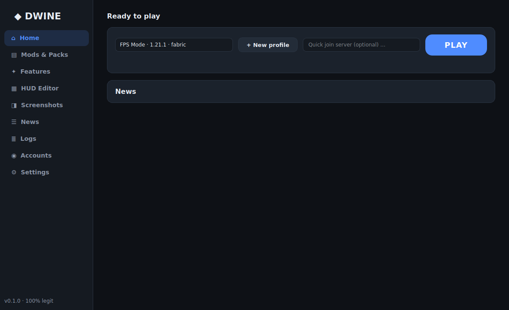
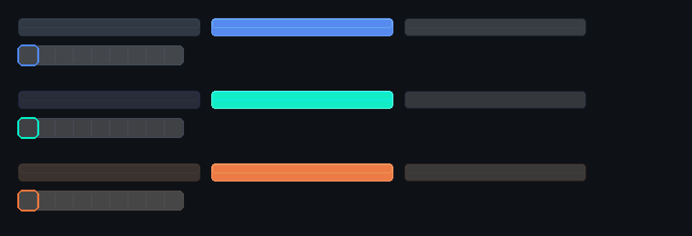
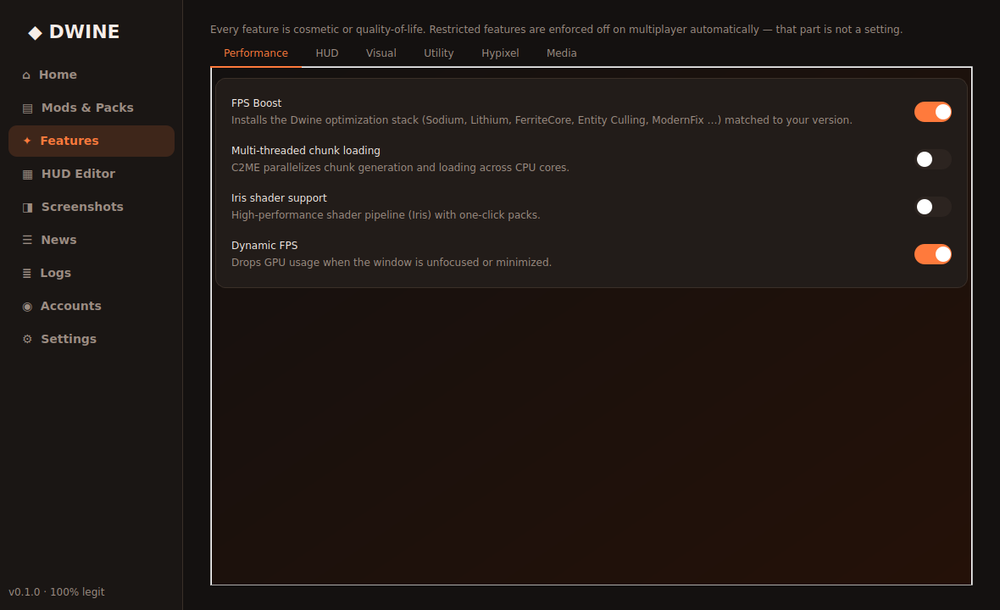
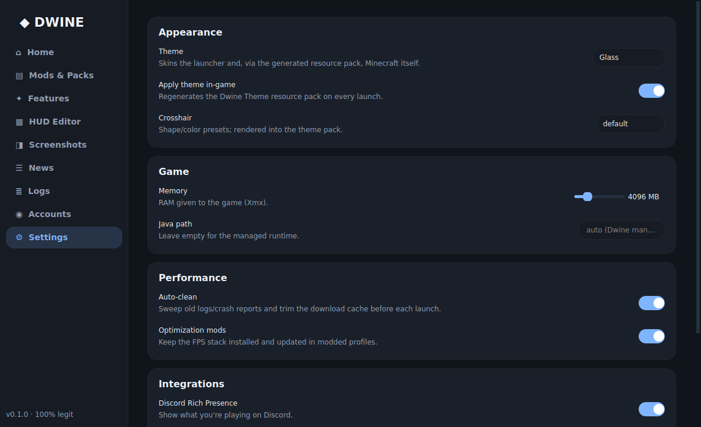

<p align="center">
  
</p>

<h3 align="center">The fully legitimate, next-generation Minecraft client + launcher.</h3>

<p align="center">
  Python-powered · Every version · Vanilla / Fabric / Quilt / Forge · 100% non-bannable by design
</p>

<p align="center">
  
  
  
  
</p>

---

Dwine is what a client looks like when *"never get banned"* is an engineering
constraint instead of a marketing line. It launches every Minecraft version,
installs a curated performance stack matched to your exact version, reskins
Minecraft's own UI through an auto-generated resource pack, and wraps it all
in a launcher that's genuinely pleasant to look at.



## Why Dwine over Lunar?

| | Dwine | Typical "client" |
|---|---|---|
| **Version support** | Every version, all four loaders (Vanilla, Fabric, Quilt, Forge) | A handful of fixed versions |
| **In-game theming** | Your theme rendered into a server-legal resource pack | Injected code you can't audit |
| **Mod source** | Official Modrinth API, sha512-verified, open source mods | Rehosted, repackaged binaries |
| **Safety** | Policy engine *in code* — automation can't run on servers even if you try | "Trust us" |
| **Extensibility** | Documented Python plugin API | Closed |
| **Cosmetics** | Free | Paid |
| **The launcher itself** | Open Python you can read in an afternoon | Closed |

## Feature tour

### 🎨 UI & theming — outside *and inside* the game
- Six built-in themes — **Dwine Dark, Light, Neon, Minimal, Glass, Ember** — plus JSON custom themes with gradients, glass panels and animated accents
- **In-game theming with zero injection**: on every launch Dwine renders your theme into the `Dwine Theme` resource pack — buttons, hotbar, menu backgrounds and crosshair — legal on every server, working on every version (legacy `widgets.png` *and* modern 1.20.2+ sprites with nine-slice metadata)
- **Drag-and-drop HUD editor** with nine-anchor snapping so layouts scale to any resolution
- **Parametric crosshair editor**: six shapes, color, gap, thickness, outline, presets
- Custom notification system, animated toggles, custom widgets throughout


*The same three themes rendered as in-game button/hotbar textures by `dwine theme build`.*

### ⚡ Performance
- **One-click FPS stack**, resolved against your exact version and loader: Sodium · Lithium · FerriteCore · Entity Culling · ModernFix · ImmediatelyFast · Krypton · Dynamic FPS · Memory Leak Fix · Starlight *(older versions)* · C2ME multi-threaded chunk loading
- Iris shader pipeline with one-click shader packs
- Managed Java runtimes (Temurin) — the right JVM per version, automatically
- Auto-cleaner for logs, crash reports and download caches with a size budget
- Parallel, checksum-verified downloads for versions, libraries and assets

### 🧩 Built-in features (all legit)
Every toggle is cosmetic or quality-of-life — information display, comfort, style:

**HUD** keystrokes · FPS/ping/CPS/memory · armor & status · saturation · compass · coordinates · clock · biome
**Visual** item physics · item resize · motion blur · hit color · custom animations · particle customizer · fullbright · custom crosshair
**Utility** zoom · toggle sprint · minimap + waypoints · death waypoints · skip death screen · friend guard · screenshot manager · replay (Replay Mod)
**Hypixel** Skyblock utilities (waypoints, dungeon map, timers, trackers) · level head · Auto GG · nick hider · party HUD · scoreboard restyling
**Media** Spotify miniplayer · Discord Rich Presence · free cosmetic capes



### 🧭 The launcher
- Microsoft login via the official device-code flow (your password never touches Dwine), multi-account switching, automatic token refresh
- Isolated **profiles** with one-click presets: `FPS`, `PvP`, `Skyblock`, `Cinematic` — each with its own mods, packs, shaders and worlds
- Mod / resource pack / shader managers with search, one-click install, dependency resolution and **Update All**
- One-click server join, server ping tester (a real Server List Ping implementation)
- Crash analyzer that turns stack traces into plain-English fixes
- News panel, patch notes, screenshot gallery + editor, live logs viewer
- Profile export/import and file-based settings sync (Dropbox/Drive/Syncthing — no Dwine account needed)
- Plugin API: drop a `.py` file in the plugins folder to add commands, hooks and UI pages



## 🔒 The safety model (read this)

Dwine's core promise is enforced by `dwine/features/safety.py`, not by a
settings page:

1. **No cheats exist in the codebase.** No packet manipulation, no movement or
   combat modification, no server-visible behavior changes. The feature catalog
   is audited by the test suite (`dwine safety` runs the same audit).
2. **Input automation is singleplayer-only — enforced.** The auto clicker is
   disabled *at launch time* for any multiplayer target, whatever your settings
   say. This is deliberately not configurable.
3. **Fair-play variants on competitive networks.** Joining Hypixel & friends
   automatically swaps radar-like tools (cave map, entity radar) for their
   fair-play builds.
4. **Nothing is injected into the game.** In-game theming is a resource pack;
   features are vetted open-source mods installed from Modrinth or config read
   by the companion mod. Resource packs and these mods are permitted by
   Hypixel's allowed-modifications policy — but rules change, so the policy
   engine is updateable and conservative by default.

> ⚠️ No client can promise more than its own behavior: always follow the rules
> of the server you play on. Dwine's job is to make the compliant path the
> only path.

## 📦 Installation

**Requirements:** Python 3.10+ · that's it. (Dwine manages Java for you.)

```bash
# 1. Install Dwine with the UI, theming and Discord extras
pip install "dwine[full] @ git+https://github.com/MilkdromedaStudios/Dwine"

# 2. Ensure the `dwine` command is available, then open the launcher
python -m dwine setup-path
# If prompted, add the printed folder to the PATH environment variable,
# then reopen your terminal.
dwine
```

If your terminal still says `dwine: command not found`, add Dwine's command
folder to your user PATH environment variable, then reopen the terminal:

- **Windows**
  - Environment variable name: `Path` under **User variables**
  - Value to add: `%APPDATA%\Python\Scripts`
  - The command file should be at: `%APPDATA%\Python\Scripts\dwine.cmd`
- **macOS / Linux**
  - Environment variable name: `PATH`
  - Value to add: `$HOME/.local/bin`
  - Add this line to `~/.bashrc`, `~/.zshrc`, or `~/.profile`:
    ```bash
    export PATH="$HOME/.local/bin:$PATH"
    ```
  - The command file should be at: `$HOME/.local/bin/dwine`

From source instead:

```bash
git clone https://github.com/MilkdromedaStudios/Dwine
cd Dwine
pip install -e ".[full]"
python -m dwine setup-path
dwine
```

First run:

1. **Accounts → Add Microsoft account** — you'll get a code to enter at
   microsoft.com/link. One-time setup: Microsoft requires launchers to bring
   their own (free) Azure app ID — create one and set `auth.client_id`
   ([how-to in `dwine/launcher/auth.py`](dwine/launcher/auth.py)).
2. **Home → + New profile** — creates the four starter profiles.
3. **Play.** Dwine installs the version, loader, mods and theme pack, then
   launches.

### Headless / CLI

Everything works without a display:

```bash
dwine versions                          # list Minecraft versions
dwine install 1.21.1 --loader fabric    # install any version + loader
dwine login                             # Microsoft device-code login
dwine launch fps-mode --server play.example.com
dwine mods search sodium --profile fps-mode
dwine mods preset performance --profile fps-mode
dwine theme set neon                    # six built-in themes
dwine theme build neon --mc 1.21       # render the in-game pack anywhere
dwine ping mc.hypixel.net               # real SLP ping tester
dwine clean --apply                     # sweep logs/caches
dwine crash fps-mode                    # analyze the last crash
dwine safety                            # run the feature-catalog audit
dwine sync push                         # settings snapshot to your sync folder
dwine update --check                    # check GitHub for a Dwine release
dwine update                            # install the newest Dwine release
dwine setup-path                        # repair/install the dwine command shim
```

## 🏗 Architecture

```
dwine/
├── core/          settings JSON system · event bus · HTTP w/ sha verification
├── launcher/      Mojang manifest · installer · Fabric/Quilt/Forge · MS auth
│                  profiles · Java runtimes · crash analyzer · news · updates
├── content/       Modrinth client · mod/pack/shader managers · presets
├── features/      feature catalog · SAFETY POLICY · HUD model · crosshair
├── theme/         theme definitions · Qt stylesheet engine · in-game pack gen
├── ui/            PySide6 launcher (custom widgets, 9 pages)
├── integrations/  Discord RPC · Spotify (PKCE) · settings sync · cosmetics
├── tools/         auto-cleaner · SLP ping · screenshots · skin changer
└── plugins/       plugin loader + stable API
```

Design rules that keep it honest:

- **Modular**: every subsystem is importable and usable without the UI.
- **No rehosting**: content comes from official APIs (Mojang, Modrinth,
  Fabric/Quilt/Forge, Adoptium) with checksums verified locally.
- **User data is sacred**: worlds, configs and screenshots are never cleanup
  candidates; tokens never leave the machine and are excluded from sync.
- **Plugins can't touch the game process** — they extend the launcher only.

## 🧪 Development

```bash
pip install -e ".[dev]"
python -m pytest          # 36 tests, offline, < 1s
dwine safety              # the audit that gates every release
```

Contributions welcome — mods proposed for the catalog must be open source,
Modrinth-hosted, and compliant with the safety model (see
`dwine/features/registry.py` for the metadata a feature needs).

## FAQ

**Is this really non-bannable?**
Dwine only ever does three things to your game: launch it (like any launcher),
install vetted open-source mods (the same ones millions use), and apply a
resource pack. The risky category — automation — is locked to singleplayer in
code. Follow your server's rules and you're fine.

**Does it work with [my version]?**
Yes. The installer speaks Mojang's official metadata, so everything from 1.0
to the latest snapshot installs — with Fabric, Quilt and Forge wherever those
loaders support the version.

**Where's the "companion mod"?**
Features marked *companion* in the catalog (custom HUD rendering, item resize,
capes, party HUD…) are configured by the launcher and rendered by the Dwine
companion Fabric mod, which lives in its own repo and is being upstreamed.
Everything else in this README works today from this repo alone.

**Why do I need my own Azure client ID?**
Microsoft requires each launcher deployment to register (free) for the login
API. It takes ~5 minutes, once, and means your auth traffic is yours alone.

---

<p align="center">
MIT © Milkdromeda Studios ·
<a href="CHANGELOG.md">Patch notes</a> ·
<a href="examples/plugins/server_status.py">Plugin example</a>
</p>
