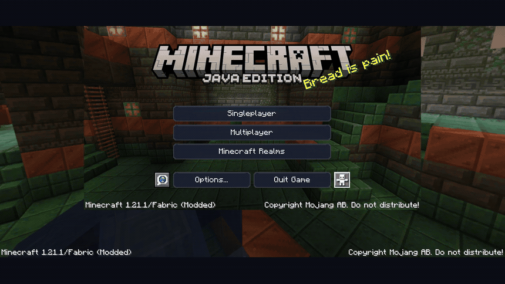
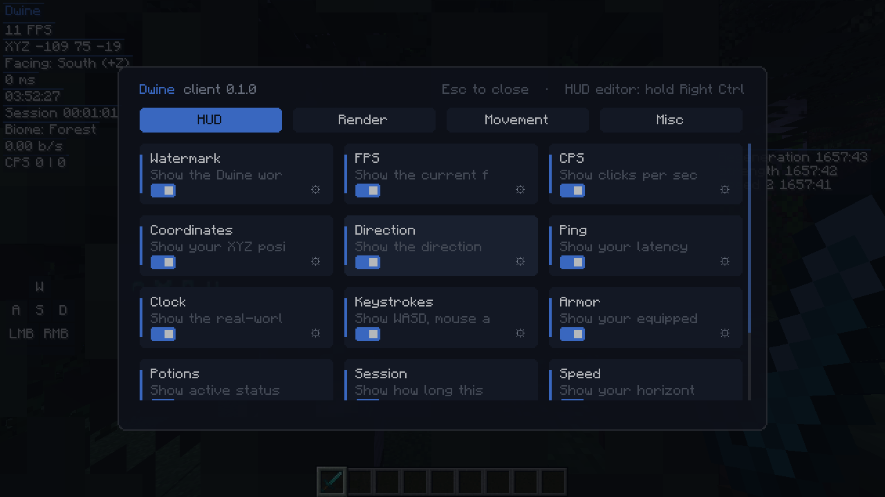
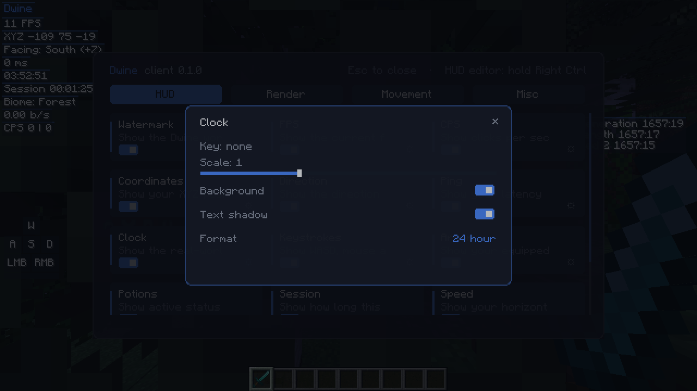
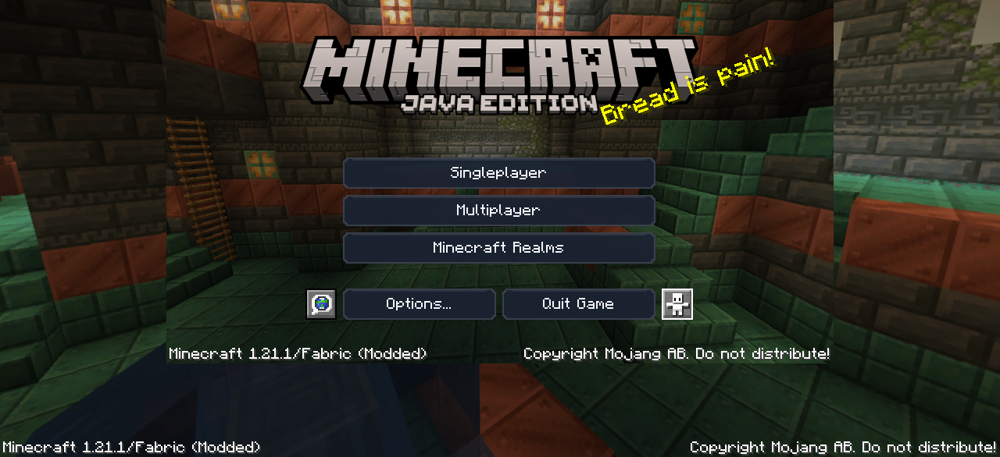
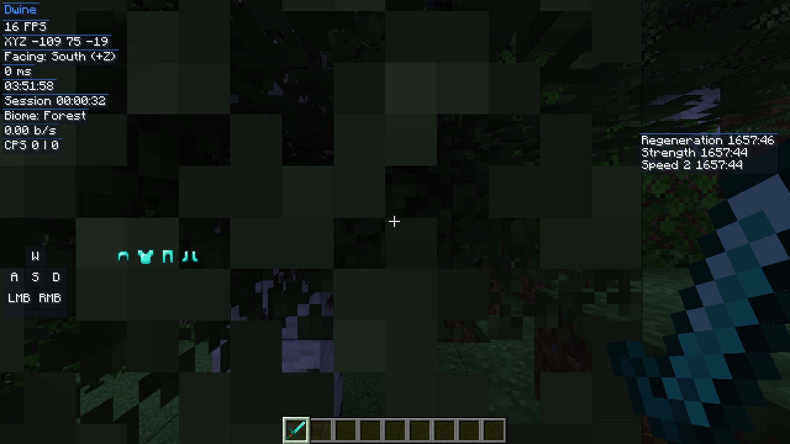

<p align="center">
  
</p>

<h3 align="center">A sleek standalone Fabric client mod for Minecraft.</h3>

<p align="center">
  Fabric · Minecraft 1.21.1 · Java 21 · Client-side quality-of-life features
</p>

<p align="center">
  
  
  
</p>

---

## 🎬 Dwine in game

Dwine is a **Fabric client mod**. There is no custom launcher, Python package, account system, or profile manager required.

<p align="center">
  
</p>

<table>
  <tr>
    <td width="50%"></td>
    <td width="50%"></td>
  </tr>
  <tr>
    <td align="center"><sub>Tile select menu — Right Shift</sub></td>
    <td align="center"><sub>Per-module settings</sub></td>
  </tr>
  <tr>
    <td width="50%"></td>
    <td width="50%"></td>
  </tr>
  <tr>
    <td align="center"><sub>Custom sleek buttons</sub></td>
    <td align="center"><sub>Configurable HUD modules</sub></td>
  </tr>
</table>

<p align="center"><sub>HUD editor: Right Ctrl · <a href="assets/media/hud-editor.png">screenshot</a> · <a href="assets/media/demo.mp4">demo video</a></sub></p>

## ✨ Features

- **Modern module menu** — press **Right Shift** to open the tile-based module menu.
- **HUD editor** — press **Right Ctrl** to drag and resize HUD elements.
- **HUD modules** — FPS, CPS, coordinates, direction, ping, clock, keystrokes, armour, potions, session timer, speed, biome, watermark.
- **Render modules** — Fullbright, Zoom, No Bobbing, FOV changer.
- **Movement modules** — Toggle Sprint, Toggle Sneak, Auto Sprint.
- **Misc modules** — Frame Limit.
- **Custom UI styling** — Dwine restyles vanilla buttons with its own client theme.
- **Standalone configuration** — settings are stored in `config/dwine/features.json` and are created automatically on first launch.

Dwine is client-side. Always follow the rules of the server you play on.

## 📦 Installation

Dwine currently targets **Minecraft 1.21.1**, **Fabric Loader 0.16.5+**, **Fabric API**, and **Java 21**.

1. Install Fabric Loader for Minecraft 1.21.1.
2. Install Fabric API for Minecraft 1.21.1.
3. Download the Dwine `.jar` from GitHub Actions or a release.
4. Put the Dwine jar into your Minecraft `mods` folder.
5. Start Minecraft using the Fabric profile.

No separate Dwine launcher is needed.

## 🔨 Building from source

```bash
git clone https://github.com/MilkdromedaStudios/Dwine-Minecraft-Launcher.git
cd Dwine-Minecraft-Launcher
./gradlew build
```

The compiled jars are written to:

```text
build/libs/
```

To launch the Fabric development client:

```bash
./gradlew runClient
```

## 🏗 Project layout

```text
src/main/java/com/dwine/
├── config/      standalone config system
├── gui/         tile menu, HUD editor, theme
├── mixin/       vanilla UI integrations
├── module/      module framework and implementations
└── setting/     module setting types

src/main/resources/
├── assets/dwine/
├── dwine.mixins.json
└── fabric.mod.json
```

## 🧪 Development

GitHub Actions builds the mod on pushes and pull requests. Tagged `v*` releases attach the built jar automatically.

```bash
./gradlew build --stacktrace
```

---

<p align="center">MIT © Milkdromeda Studios</p>
